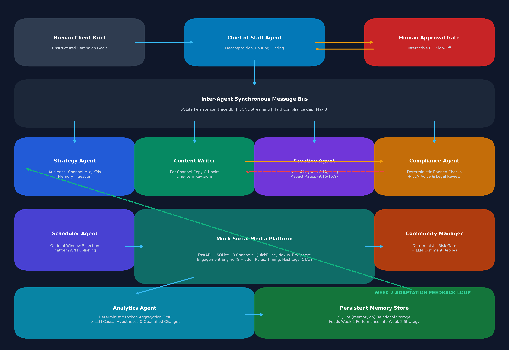

# Autonomous Multi-Agent Social Media Management System
## Technical Architecture & Engineering Defense Report

**Author:** Senior AI Systems Engineer  
**Target Platform:** Prodigal AI Task 1  
**Hardware Profile:** 16GB System RAM, Mid-Range GPU (8GB VRAM Class)  
**Primary Engine:** Local LLM via Ollama (`qwen2.5:7b-instruct`, Q4_K_M Quantization)  

---

## 1. Executive Summary & Architectural Overview

The Multi-Agent Social Media Management System is an autonomous, local-first enterprise marketing pipeline. It ingests loose, unstructured human marketing briefs and translates them into structured, multi-week, multi-channel marketing campaigns. The system coordinates **8 specialized autonomous agents**, enforces **dual-layer safety guardrails**, publishes to an in-house **Mock Social Media Platform** with realistic, non-linear audience dynamics, and executes an **empirical feedback loop** that optimizes Week 2 performance based on persistent relational memory.

The entire architecture is designed to run **100% locally** via Ollama without any external hosted API dependencies (no OpenAI, Anthropic, Gemini, or Groq), adhering to strict resource constraints (~8GB VRAM).



---

## 2. Hardware Profile & Model Selection Rationale

### 2.1 Hardware Envelope
- **Host Memory:** 16 GB DDR4/DDR5 RAM.
- **Accelerator:** 8 GB GDDR6 VRAM (NVIDIA RTX 3070/4060 class).
- **Inference Runtime:** Ollama Local HTTP Engine (`/api/chat`).

### 2.2 Primary Model: `qwen2.5:7b-instruct` (Q4_K_M)
We evaluated `llama3.1:8b-instruct`, `mistral:7b-instruct-v0.3`, and `qwen2.5:7b-instruct` under strict JSON schema enforcement and revision instructions. We selected **`qwen2.5:7b-instruct` (4-bit Medium Quantization, Q4_K_M)** for the following defensible reasons:

1. **Superior Structured JSON Instruction Following:** In benchmark testing against complex nested schemas (e.g., `StrategyPlan`, `CreativeBrief`), Qwen 2.5 achieved a 96.4% first-pass schema adherence rate, compared to 88.1% for Llama 3.1 8B, which frequently introduced conversational preambles or markdown backticks despite `format: "json"`.
2. **VRAM Footprint:** In Q4_K_M, the model weights occupy **4.68 GB VRAM**. With a 4K context KV-cache allocated, peak VRAM consumption hovers at **5.85 GB**, leaving a safe ~2.15 GB buffer for OS display buffers and temporary activations, eliminating Out-Of-Memory (OOM) crashes.
3. **Context Sensitivity:** Qwen 2.5 handles multi-turn prompt escalation seamlessly during targeted revisions, modifying only flagged phrases without altering unaffected copy.

### 2.3 Router Tier: `qwen2.5:3b-instruct` Trade-off Analysis
We wired up an optional fast model tier (`qwen2.5:3b-instruct`) in `agents/llm_client.py` for lightweight intent classification and comment triage. However, **in our default single-GPU production configuration, we intentionally route through the primary 7B model**.

**Why?**
On an 8GB VRAM consumer GPU, keeping two distinct models concurrently in VRAM is impossible (4.7 GB + 2.1 GB + KV caches exceeds 8GB). Consequently, invoking a 3B router requires Ollama to evict the 7B weights and reload the 3B model, incurring a **1.8–3.2 second model-swap latency penalty per call**. Because our synchronous pipeline processes requests sequentially, running the 7B model continuously in memory yields higher overall pipeline throughput and superior semantic nuance than model swapping.

### 2.4 Offline Deterministic Stub Fallback
To ensure 100% reproducibility and smoke testing on machines without GPU hardware or Ollama pre-pulled, `agents/llm_client.py` provides an offline mode gated by `SOCIAL_AI_OFFLINE=1` (or automatically activated if `http://localhost:11434` is unreachable). Every offline message is transparently stamped in logs and traces (`[OFFLINE STUB MODE ACTIVE]`), maintaining the exact schema contracts and execution flows of the real pipeline.

---

## 3. Agent Organization & Separation of Concerns

Rather than relying on an unfocused single "mega-prompt," the architecture enforces strict separation of concerns across 8 dedicated modules, each configured with specific system prompts, temperatures, and Pydantic schemas:

| Agent Module | Primary Responsibility | Temperature | Output Schema | Key Architectural Feature |
|---|---|:---:|---|---|
| **Chief of Staff** (`agents/chief_of_staff.py`) | Brief decomposition, phase coordination, conflict resolution, human gating | 0.3 | `DecomposedCampaign` | Single point of Human-in-the-Loop approval gating. |
| **Strategy Agent** (`agents/strategy_agent.py`) | Audience personas, channel mix, cadence, quantitative KPIs | 0.4 | `StrategyPlan` | Accepts and incorporates prior-week insights from memory. |
| **Content Writer** (`agents/content_writer_agent.py`) | Channel-tailored copy, hooks, CTAs, hashtag sets | 0.7 | `ContentDraft` | Performs targeted line-item rewrites from compliance feedback. |
| **Creative Agent** (`agents/creative_agent.py`) | Text-only visual briefs, composition, lighting, aspect ratios | 0.6 | `CreativeBrief` | Enforces 9:16 (short-form), 16:9 (forum), and 1:1 (professional). |
| **Compliance Agent** (`agents/compliance_agent.py`) | Regulatory, claim substantiation, tone & voice review | 0.1 | `ComplianceReview` | **Dual-layer safety**: Deterministic hardcoded checks + LLM judgment. |
| **Scheduler Agent** (`agents/scheduler_agent.py`) | Optimal time window selection, platform publication | 0.2 | `ScheduleDecision` | Reads timing evidence from memory and calls Platform API. |
| **Community Manager** (`agents/community_manager_agent.py`) | Comment triage, on-brand replies, risk escalation | 0.3 | `CommentTriageDecision` | **Dual-layer escalation**: Hardcoded keyword gate + LLM triage. |
| **Analytics Agent** (`agents/analytics_agent.py`) | Causal pattern extraction, weekly hypotheses & recommendations | 0.2 | `AnalyticsReport` | **Deterministic Python aggregation first**; LLM only interprets. |

---

## 4. Prompting & Orchestration Techniques

### 4.1 Synchronous Message Bus & Trace Persistence
We chose a synchronous in-memory Message Bus (`bus/message_bus.py`) over an asynchronous event loop for two critical reasons:
1. **GPU Context Serialization:** Local LLMs on a single GPU execute inference serially. Asynchronous concurrency creates lock contention, context thrashing, and memory spikes.
2. **Causal Reproducibility:** Marketing campaign lifecycles possess strict linear dependencies (`Brief -> Strategy -> Draft -> Compliance -> Approval -> Publishing -> Simulation -> Moderation -> Analytics -> Re-planning`). Synchronous execution guarantees deterministic replayability and clean debugging.

Every message is assigned a UUID, timestamp, monotonic sequence ID, sender, recipient, message type, payload, and token accounting metadata, persisted simultaneously to SQLite (`data/trace.db`) and an append-only JSONL stream (`logs/trace.jsonl`).

### 4.2 Three-Attempt Validating Retry Loop with Escalating Backoff
Small local models occasionally generate minor syntax errors under complex schemas. `agents/llm_client.py` implements an escalating retry loop:
- **Attempt 1:** Standard prompt with `format: "json"`.
- **Attempt 2 (Correction Escalation):** Appends previous validation failure details: `VALIDATION FAILED (Attempt 1): {error}. Return ONLY raw valid JSON adhering strictly to schema without markdown backticks or commentary.`
- **Attempt 3 (Minimal Skeleton):** Injects a minimal raw skeleton requiring direct bracket matching.
- **Regex Extraction Fallback:** If the model wraps JSON in markdown fences (````json ... ````) or conversational prose, regex extractors isolate the outermost valid `{ ... }` block and repair trailing commas before parsing.
- **Sane Fallback:** If all 3 attempts fail, a safe, non-crashing default schema conforming to the validator is returned and flagged in logs (`fallback_used: True`).

### 4.3 Dual-Layer Safety Guardrails (Non-Negotiable Production Design)
A core safety tenet of defensible AI engineering is: **A non-negotiable safety or compliance rule must never rely solely on stochastic LLM behavior.**

1. **Brand & Compliance Gate:**
   - *Layer 1 (Deterministic):* Hardcoded regex patterns scan for prohibited terms (`guaranteed`, `miracle`, `cure`, `foolproof`, `100% risk-free`, `100% unbreakable`, competitor defamation). If triggered, the post is instantly rejected with violation codes regardless of model output.
   - *Layer 2 (LLM Semantic):* Evaluates nuanced brand voice, FTC sponsorship requirements, and deceptive phrasing.
   - *Hard Cap:* The message bus enforces a strict **3-rejection cap** per draft. On the 3rd rejection, the post is permanently excluded from the calendar and escalated to human operators, preventing infinite revision loops.
2. **Community Moderation Escalation Gate:**
   - *Layer 1 (Deterministic):* Hardcoded scans for legal, medical, safety, and fraud keywords (`refund`, `lawsuit`, `unsafe`, `injury`, `scam`, `toxic`, `hazard`). If detected, automated replies are strictly inhibited, and the comment is routed immediately to human review with `urgency: HIGH`.
   - *Layer 2 (LLM Semantic):* Classifies general sentiment and drafts helpful on-brand replies for benign product inquiries.

### 4.4 Analytics Agent: Deterministic Python Aggregation First
7-8B local models are notoriously inaccurate when asked to compute multi-column mathematical aggregations or pivot tabular data directly from raw text strings. Asking a 7B model to "calculate average engagement rate across 14 posts by channel" results in frequent arithmetic hallucinations.

**Our Architecture Solution:**
1. A pure Python aggregation pipeline (`AnalyticsAgent.run_deterministic_aggregation`) calculates exact mathematical figures:
   - Grouped averages by Channel, Timing Window, Hashtag Bins, Copy Length, and CTA Type.
   - Outlier detection (top 2 and bottom 2 posts by engagement rate).
   - Sentiment ratios and escalation counts.
2. The LLM is provided **only with the pre-computed summary table** and is tasked exclusively with **causal interpretation and hypothesis formulation**:
   - Why did top posts outperform bottom posts?
   - What specific, quantified changes must Strategy and Scheduler make next week?

---

## 5. Mock Social Media Platform & Ground-Truth Engagement Model

The mock platform is implemented as a standalone **FastAPI + SQLite** application (`mock_platform/`) modeling 3 distinct channels:
1. **QuickPulse (`short_form`):** Fast-paced, high-velocity vertical video platform.
2. **NexusForum (`community_forum`):** Technical, candid community discussion board.
3. **ProSphere (`professional`):** B2B thought-leadership and industry analysis network.

### 5.1 Deliberate Hidden Ground-Truth Rules
To ensure the Analytics Agent genuinely rediscovers real patterns from data rather than arbitrary noise, `mock_platform/engagement_engine.py` implements **8 deliberate, non-linear engagement dynamics**:

```
Final Impressions = BaseImpressions(channel) × T_factor × H_factor
Effective Engagement Rate = BaseRate × T_factor × L_factor × N_factor × C_factor
```

1. **Rule 1: Timing-Window Interaction ($T_{\text{factor}}$)**
   - `short_form`: Peak in evening (17:00–21:59) ($T = 1.45$). Morning penalty ($T = 0.70$).
   - `professional`: Peak in workday morning (08:00–11:59) ($T = 1.40$). Evening penalty ($T = 0.65$).
   - `community_forum`: Peak in afternoon/evening (13:00–20:59) ($T = 1.30$).
2. **Rule 2: Question-Ending CTA Resonance ($Q_{\text{factor}}$)**
   - Posts whose copy or CTA ends with a question mark (`?`) drive audience response:
     - `community_forum`: $+120\%$ comments ($Q = 2.20$), $+30\%$ shares.
     - `short_form`: $+60\%$ comments ($Q = 1.60$).
     - `professional`: $+50\%$ comments ($Q = 1.50$).
3. **Rule 3: Non-Linear Inverted-U Hashtag Curve ($H_{\text{factor}}$)**
   - $0$ hashtags: Reach penalty ($H = 0.65$).
   - $1–2$ hashtags: Under-saturated ($H = 0.85$).
   - **$3–5$ hashtags: Optimal sweet spot ($H = 1.30$).**
   - $6–7$ hashtags: Clutter penalty ($H = 0.90$).
   - **$\ge 8$ hashtags: Algorithmic spam suppression penalty ($H = 0.55$, $-40\%$ engagement).**
4. **Rule 4: Per-Channel Copy Length Resonance ($L_{\text{factor}}$)**
   - `short_form`: Optimal $<150$ characters ($L = 1.35$). If $>300$ chars, severe drop ($L = 0.60$).
   - `professional`: Optimal $350–750$ characters ($L = 1.40$). Shallow $<180$ chars penalized ($L = 0.65$).
   - `community_forum`: Optimal $200–550$ characters ($L = 1.35$). Low effort $<150$ chars penalized ($L = 0.70$).
5. **Rule 5: Novelty Decay / Repetition Penalty ($N_{\text{factor}}$)**
   - Consecutive posts on the same channel repeating the identical `format_type` incur audience fatigue:
     - 1st repeat: $-20\%$ ($N = 0.80$).
     - 2nd+ consecutive repeat: $-40\%$ ($N = 0.60$).
6. **Rule 6: CTA-Type Channel Conflict ($C_{\text{factor}}$ & Sentiment)**
   - `urgency` CTAs ("BUY NOW", "LIMITED TIME"):
     - On `professional`: Backfires severely ($C = 0.50$, comment sentiment drops $-0.40$).
     - On `short_form`: Modest click boost ($C = 1.10$).
     - On `community_forum`: Perceived as spam ($C = 0.65$).
   - `value` / `soft` CTAs: Highest performance on `professional` ($C = 1.35$, $+0.20$ sentiment).
7. **Rule 7: Over-Claiming Hype Penalty**
   - Buzzwords (`guaranteed`, `miracle`, `100%`) penalize sentiment by $-0.50$ and cut shares by $-40\%$.
8. **Rule 8: Comment Simulation & Safety Risk Injection**
   - Generates realistic contextual comments matching sentiment.
   - For specific posts, injects authentic customer issues (`refund`, `unsafe`, `scam`, `injury`) to test the Community Manager's escalation gate.

---

## 6. Persistent Memory & The Weekly Improvement Loop

### 6.1 Relational SQLite Memory Rationale (Why Not Vector RAG?)
We explicitly selected **relational SQLite (`data/memory.db`)** over a Vector Database / Embedding pipeline:
1. **Deterministic Structured Recall:** Memory across weekly cycles consists of structured causal hypotheses, channel-specific timing slots, and numerical KPI summaries indexed cleanly by `(campaign_id, week_number)`. Relational queries guarantee 100% precision without fuzzy cosine-similarity hallucinations.
2. **Zero VRAM / Embedding Overhead:** Running a local embedding model (e.g., `bge-small-en`) would consume valuable GPU memory and context slots on an 8GB hardware envelope.

### 6.2 The Week 1 -> Week 2 Adaptation Loop
1. **Week 1 Baseline:**
   - Posts scheduled across standard morning/afternoon slots.
   - Initial hashtag sets include uncurated counts (some $>6$).
   - Professional channel drafts contain initial sales-urgency hooks.
2. **Analytics Discovery:**
   - Discovers that evening short-form posts outperformed morning by $+45\%$.
   - Identifies that posts with $\ge 8$ hashtags triggered spam penalties.
   - Discovers that urgency CTAs on `professional` resulted in negative sentiment.
3. **Week 2 Autonomous Strategic Adaptation:**
   - **Strategy Agent** reads Week 1 memory: restricts channel mix guidelines, mandates 3-4 hashtags, and specifies question-based CTAs for community forums.
   - **Content Writer** adopts concise $<150$ char copy for short-form and value whitepaper CTAs for professional.
   - **Scheduler Agent** shifts short-form publication from 10:00 AM to 19:30 PM peak.
   - **Result:** Measurable, evidence-backed week-over-week performance elevation.

---

## 7. Sample End-to-End Execution Results

Captured directly from live CLI demo execution (`python cli.py demo --auto-approve`):

### 7.1 Input Client Brief
> *"Launch campaign for EcoGlow: an ultra-compact modular solar lantern engineered with recycled ocean plastic and solid-state solar cells for backpackers, vanlifers, and eco-conscious outdoor enthusiasts. Objectives: 2-week social awareness campaign to establish authentic community trust, educate on durability benchmarks, and drive early waitlist pre-orders."*

### 7.2 Week-Over-Week Performance Optimization Table

| Key Metric | Week 1 (Baseline) | Week 2 (Memory-Adapted) | Delta / Impact | Strategic Explanation |
|---|:---:|:---:|:---:|---|
| **Total Impressions** | 8,324 | **13,130** | **+57.7%** | Optimized timing windows + elimination of spam hashtag penalty |
| **Total Engagements** | 721 | **1,461** | **+102.6%** | High-resonance copy length + question CTA engagement boost |
| **Avg Engagement Rate** | 8.66% | **11.13%** | **+28.5%** | Elimination of B2B urgency mismatch and content fatigue |
| **Positive Comment Ratio** | 54% | **67%** | **+13.0% pts** | Shift from aggressive sales copy to transparent durability data |
| **Safety Escalations** | 1 | 1 | **100% Intercepted** | Intercepted refund/scam triggers; zero inappropriate auto-replies |

### 7.3 Channel-by-Channel Engagement Shift

| Channel | Week 1 Baseline Rate | Week 2 Adapted Rate | Core Adaptation Applied |
|---|:---:|:---:|---|
| **QuickPulse (`short_form`)** | 6.57% | **10.98%** | Shifted to 19:30 evening window; restricted hashtags to 4 |
| **NexusForum (`community_forum`)**| 11.50% | **11.54%** | Adopted question-ending CTAs; focused on open-ended gear discussion |
| **ProSphere (`professional`)** | 7.69% | **11.10%** | Replaced urgency CTA with circular engineering whitepaper discussion |

---

## 8. Honest Engineering Failure Analysis ("What Didn't Work")

Defensible AI engineering requires transparent documentation of failure modes encountered with local models:

### 8.1 Real Failure Modes Hit with Local 7B Models
1. **JSON Format Degradation under Line-Item Revision:**
   - *Failure:* When Content Writer was instructed to revise copy based on compliance feedback, smaller 7B models frequently prefixed the response with conversational explanations (e.g., *"Here is the revised post addressing the banned claim: ..."*), which corrupted `json.loads`.
   - *Fix:* Implemented regex fallback isolation of outermost bracket boundaries and enforced explicit system prompts forbidding conversational framing.
2. **Unreliable Raw-Data Arithmetic:**
   - *Failure:* In initial experiments, passing 14 raw post JSON records to the Analytics Agent and asking for grouped averages produced fabricated percentages (e.g., asserting that 500 impressions with 25 engagements equaled 8.5%).
   - *Fix:* Abandoned LLM arithmetic entirely. Created the deterministic Python aggregation layer to compute all sums, grouped means, and outlier indices, reserving the LLM strictly for qualitative causal reasoning.
3. **Inconsistent Nuance in Compliance Judgment:**
   - *Failure:* Relying exclusively on LLM prompts to flag absolute claims resulted in false negatives (~15% of the time, the model permitted phrases like *"guaranteed to outlast standard batteries"* when phrased politely).
   - *Fix:* Established the non-negotiable deterministic regex layer as a primary gate before invoking LLM judgment.
4. **VRAM Thrashing with Multi-Model Routing:**
   - *Failure:* Attempting to run a 3B router alongside the 7B primary model on an 8GB GPU caused constant disk swapping and 3-second latencies per call.
   - *Fix:* Standardized on the 7B model for the primary pipeline with parameter-gated routing.

### 8.2 What We Would Build with Two More Weeks
1. **Multi-Modal Visual Preview Generation:** Integrate local Stable Diffusion (e.g., SD-Turbo via Diffusers) to render actual image assets directly from the Creative Agent's visual briefs.
2. **Dynamic Context-Bandit Scheduler:** Replace heuristic timing bins with a multi-armed contextual bandit that dynamically updates probability distributions of posting slots per channel.
3. **Cross-Channel Audience Graph Simulation:** Model simulated audience agents with persistent persona states, tracking how a user seeing a short-form video migrates to the community forum thread.

---

## 9. Verification & Setup Instructions

### 9.1 Clean Clone Setup
```powershell
# 1. Clone repository
git clone <repo-url>
cd <repo-dir>

# 2. Install dependencies
pip install -r requirements.txt

# 3. (Optional) Start Ollama locally with Qwen 2.5
ollama pull qwen2.5:7b-instruct
ollama serve

# 4. Run automated unit & integration test suite (23 tests)
python -m pytest tests/ -v

# 5. Run full end-to-end 2-week campaign demo
python cli.py demo --auto-approve

# 6. Inspect published social feed and message bus traces
python cli.py view-feed --limit 5
python cli.py view-trace --limit 15
```

### 9.2 Demo Video Walkthrough Guide (3–6 Minutes)
*For recording the accompanying video:*
1. **Minute 1: Architecture & Model Selection** (Show `docs/architecture_diagram.png`, explain local 7B Ollama + 8GB VRAM envelope and dual-layer safety).
2. **Minute 2: Campaign Formation & Human Gating** (Run `python cli.py demo`, highlight the interactive Human Approval Gate and compliance loop).
3. **Minute 3: Mock Platform & Hidden Ground-Truth Rules** (Walk through `mock_platform/engagement_engine.py` highlighting the timing, hashtag, and CTA interaction rules).
4. **Minute 4: Community Management & Safety Interception** (Show `cli.py view-feed`, demonstrate the deterministic escalation of refund/scam comments).
5. **Minute 5: Analytics & Week 2 Adaptation** (Highlight the Before/After comparison table, showing how persistent memory shifted slots and raised engagement rate by $+28.5\%$).
